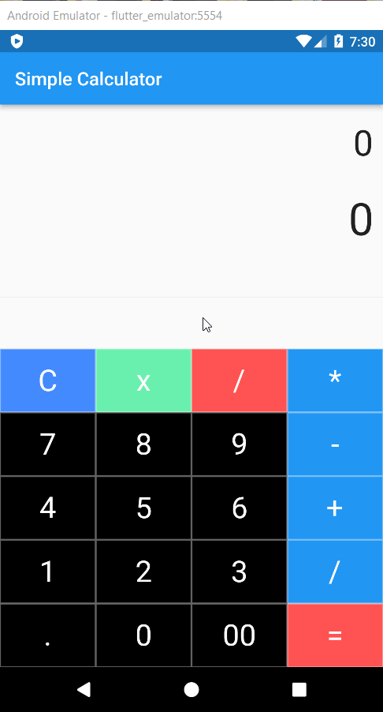
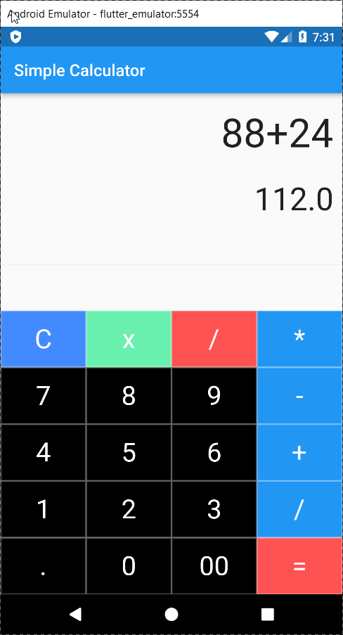
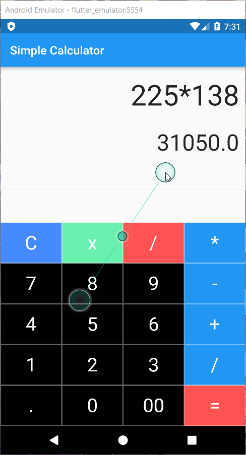
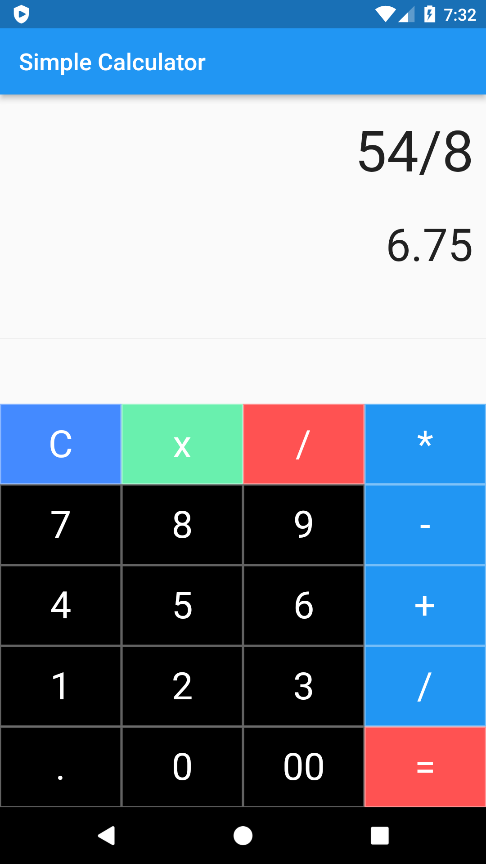

# Simple Calculator

Simple Calculator using Flutter
 

### Screenshots

  
 
 
 
  

 
I've used Dart & Flutter while creating this Calculator app. As of now this app performs simple operations like "Addition", "Subtraction", "Multiplication" & "Division".
 
With time I will try to implement various mathemtical functions like sine, cosine, logarithmic, exponential etc to enhance the application of this app

 
Pull requests are open for the app
